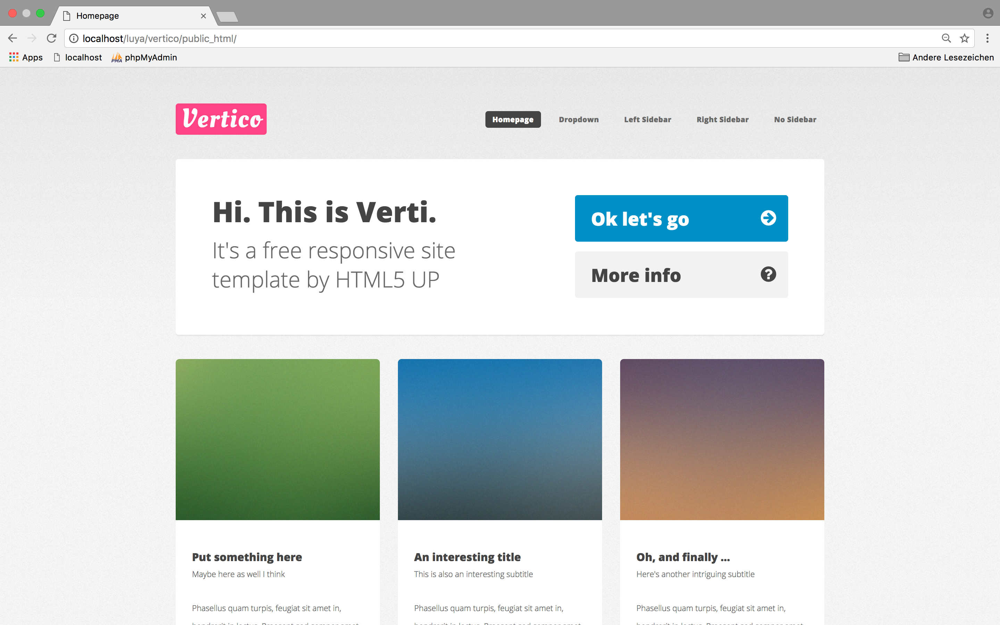

# VERTICO LUYA CMS KICKSTARTER



## Features

* [LUYA CMS](https://luya.io) integration and easy extendability
* Fully responsive and ready to use
* Admin area integration
* Multilevel Menu included
* SCSS and Gulp worklfow included
* more ...


## Installation

#### 1.) Fork Repo or clone from Git:

```sh
git clone git@github.com:dev7ch/vertico.git vertico
```

> This will clone this Repo to install the current dev-master of LUYA CMS and its modules.

#### 2.) Navigate to project root and and rename Configs

```sh

cd configs &&
cp env.php.dist env.php &&
cp env-local-db.php.dist env-local-db.php &&
cp luya_vertico_demo.sql.dist luya_vertico_demo.sql

```

> In <code>configs/env-local-db.php</code> the user and password for the database connection need to be set.


Rename example DB in configs folder:

```sh

cp luya_vertico_demo.sql.dist luya_vertico_demo.sql

```
Create empty database with for provided DB information and import example DB from '/config/luya_vertico_demo.sql'

#### 3.) Get all dependencies ready for setup


```sh
composer install

```

> Get more help in [the LUYA CMS Install Guide](https://luya.io/guide/install).

#### 4.) Setup LUYA CMS

```sh

./vendor/bin/luya migrate
./vendor/bin/luya import

```

you could check the health of the cms system

```sh
./vendor/bin/luya health

```

#### 4.) Done! Login to your new Website

If all went fine and no error's shown in Terminal head over to your 
new Website, obviously 'http//localhost/vertico/public_html'


- <code> http://localhost/vertico/public_html </code>

- <code> http://localhost/vertico/public_html/admin </code>

Please follow the [Luya Guide](https://luya.io/guide) to add a new user

```sh 
admin/setup/user

```

## Front-End

<b>Vertico</b> is a modern, fully responsive theme by <a href="https://html5up.net">HTML5 UP</a>.  


### Libraries

These frontend libraries are included and available.

[» jQuery (yii\web\JqueryAsset)](http://www.yiiframework.com/doc-2.0/yii-web-jqueryasset.html)  
[» Fontawesome Icons](http://fontawesome.io/)  
[» Skell Responsive Framework](https://github.com/ajlkn/skel)  


### Compiling

We have created our own NPM Package that includes our gulp workflow.  
Inside the `resources/` folder, everything is prepared.

```sh
cd resources

npm install 
npm install gulp

```

See [zephir/zephir-gulp-workflow](https://github.com/zephir/zephir-gulp-workflow) for a full documentation of the workflow.

# Backend

### Assets

To speed up your local development you can uncomment the following lines in `configs/local.php` in order to use symlinking your assets instead of copy them every run.

```php
'assetManager' => [
    'class' => 'luya\web\AssetManager',
    'linkAssets' => true,
],
```

Now all assets will be symlinked and not copied.

> This will also enable CSS instant reload provided by `browserSync` (gulp).
